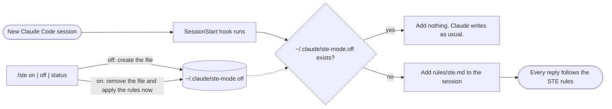

# ste-mode

A writing mode for Claude Code. It makes Claude write in a **Simplified Technical English style**:
short active sentences, plain words, one meaning per word. Replies are easier to read, to translate, and to
listen to with a text-to-speech voice.

> **Not official.** This is a style guide inspired by Simplified Technical English. It is **not** the ASD-STE100
> specification, it has no approved-word dictionary, and its output is **not certified**. This project is not
> affiliated with or endorsed by ASD. The official specification is at [asd-ste100.org](https://www.asd-ste100.org/).

## See the difference

Same question, same model. First the default reply, then the reply with `ste-mode` on.

**Question:** *Explain in a short paragraph why you should not commit secrets to git, and what to do if you already did.*

**Default**

> Committing secrets (API keys, passwords, tokens, private keys) to git is dangerous because git keeps history. Even if you delete the secret in a later commit, it stays in every clone, fork, and cached copy, and automated scrapers find leaked credentials on public repos within minutes. Anyone with read access can then impersonate you or your service, and a private repo can become public later or be exposed through a compromised account. If you already did it, **rotate or revoke the credential first**, because you should treat it as compromised no matter what you do to the repo. Then remove it from the working tree and add the file to `.gitignore`. You can optionally scrub it from history with `git filter-repo` or BFG and force-push. Ask collaborators to re-clone, and ask the host to purge cached views if needed. Check your provider's access logs for misuse. To prevent a repeat, load secrets from environment variables or a secrets manager, and add a pre-commit scanner such as `gitleaks` or GitHub push protection.

**With `ste-mode`**

> Do not commit secrets, such as passwords, API keys, or tokens, to git. Git keeps the full history, so a secret stays in old commits after you delete it from the files. Anyone with access to the repository can read it. Bots scan public repositories and find new secrets in minutes. Clones and forks keep a copy too.
>
> If you already committed a secret, do these steps. Warning: removing the secret from the history does not make it safe, because someone could already have a copy.
>
> 1. Revoke the secret and create a new one. Do this first. It is the only step that fully protects you.
> 2. Check the logs of the service for use of the old secret.
> 3. Remove the secret from the history with `git filter-repo` or BFG Repo-Cleaner. Then force-push.
> 4. Tell all collaborators to clone the repository again, so they do not push the old history back.
> 5. Add the file to `.gitignore`. Add a scanner, such as `gitleaks` or GitHub push protection, to stop a repeat.

The mode turns one dense paragraph into short sentences, a warning before the step it applies to, and numbered steps.
Commands such as `git filter-repo` stay exactly as they are.

| | Default | With `ste-mode` |
| --- | --- | --- |
| Question above: average sentence length | 18.9 words | 10.4 words |
| Question above: longest sentence | 30 words | 19 words |
| Question above: contractions | 1 | 0 |
| A second question (`ModuleNotFoundError` after `pip install`): average sentence length | 14.6 words | 9.6 words |
| A second question: longest sentence | 27 words | 21 words |
| A second question: contractions | 6 | 0 |

These are one run per question, measured with a simple script that splits text at punctuation. Treat them as a
rough guide, not a benchmark. Replies vary from run to run.

## Background

In October 2026, Andrej Karpathy [wrote on X](https://x.com/karpathy/status/2105819303471976479) that we will spend more time trying to understand the outputs of
language models. His first tip was about writing:

> Something I've had success with: Ask your LLM to explain something in ASD-STE100, it's a controlled language
> specification originally developed for aerospace maintenance documentation. LLMs well-versed in this language
> and it comes with heavy constraints on clean writing style that I often find a lot more readable. Sometimes
> I've tried to soften it a bit e.g. ask for "80% of the way to ASD-STE100" because the spec is quite stringent.
>
> ([Andrej Karpathy, post on X](https://x.com/karpathy/status/2105819303471976479), October 2026. Excerpt.)

`ste-mode` turns that habit into a switch you can leave on. It is in the spirit of his softer request: it keeps the
short active sentences and plain words, and it leaves out the approved-word dictionary and most of the full rule
set. It does not measure how close a reply is to the specification. Karpathy did not write, review or endorse
this plugin.

## Install

```
/plugin install ste-mode --marketplace powerpratik/ste-mode
```

Answer `y` to "Add marketplace?" and press Enter on the user scope. The mode is active in new sessions.

## Use

| Command | Effect |
| --- | --- |
| `/ste` or `/ste status` | Show whether the mode is on |
| `/ste on` | Turn it on now, and for new sessions |
| `/ste off` | Turn it off for this session and new sessions |

The mode is **on by default** after install. `/ste off` creates the file `~/.claude/ste-mode.off`; `/ste on`
removes it.

## How it works



A `SessionStart` hook adds the rules in [`rules/ste.md`](rules/ste.md) to each new session, the same way Anthropic's
own style plugins work. The `/ste` command switches the mode by creating or removing one empty file. The plugin
makes no network calls and never reads your prompts or files.

## What the rules ask for

- sentences of 20 words or fewer for instructions, 25 for descriptions, one idea each
- the active voice, commands for instructions, and only the simple tenses
- articles (the, a, an) and no contractions
- plain words with one meaning, used the same way every time; no idioms, slang or phrasal verbs
- prose only: code, commands, paths, URLs and error messages stay exactly as they are

You can edit `rules/ste.md` to fit your own needs.

## Check

```
bash tests/test-hook.sh
claude plugin validate .
```

## License

MIT. See [LICENSE](LICENSE).
